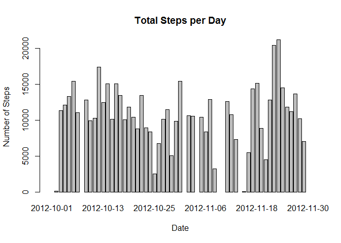
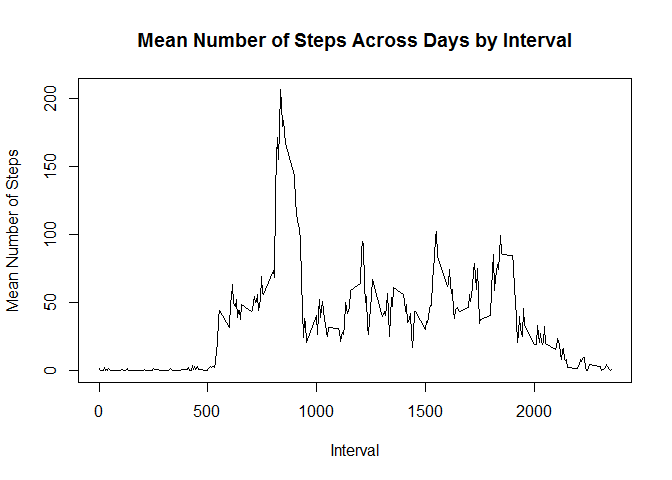
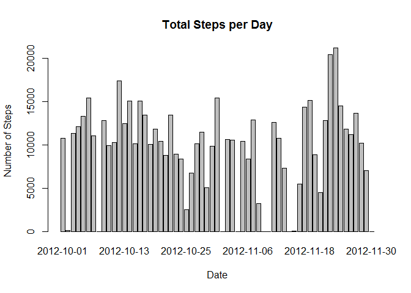

# Reproducible Research: Peer Assessment 1


## Loading and preprocessing the data

```r
data = read.csv("activity.csv")
stepsum = tapply(data$steps, data$date, FUN=sum)
stepsum
```

```
## 2012-10-01 2012-10-02 2012-10-03 2012-10-04 2012-10-05 2012-10-06 
##         NA        126      11352      12116      13294      15420 
## 2012-10-07 2012-10-08 2012-10-09 2012-10-10 2012-10-11 2012-10-12 
##      11015         NA      12811       9900      10304      17382 
## 2012-10-13 2012-10-14 2012-10-15 2012-10-16 2012-10-17 2012-10-18 
##      12426      15098      10139      15084      13452      10056 
## 2012-10-19 2012-10-20 2012-10-21 2012-10-22 2012-10-23 2012-10-24 
##      11829      10395       8821      13460       8918       8355 
## 2012-10-25 2012-10-26 2012-10-27 2012-10-28 2012-10-29 2012-10-30 
##       2492       6778      10119      11458       5018       9819 
## 2012-10-31 2012-11-01 2012-11-02 2012-11-03 2012-11-04 2012-11-05 
##      15414         NA      10600      10571         NA      10439 
## 2012-11-06 2012-11-07 2012-11-08 2012-11-09 2012-11-10 2012-11-11 
##       8334      12883       3219         NA         NA      12608 
## 2012-11-12 2012-11-13 2012-11-14 2012-11-15 2012-11-16 2012-11-17 
##      10765       7336         NA         41       5441      14339 
## 2012-11-18 2012-11-19 2012-11-20 2012-11-21 2012-11-22 2012-11-23 
##      15110       8841       4472      12787      20427      21194 
## 2012-11-24 2012-11-25 2012-11-26 2012-11-27 2012-11-28 2012-11-29 
##      14478      11834      11162      13646      10183       7047 
## 2012-11-30 
##         NA
```

## What is mean total number of steps taken per day?

```r
barplot(stepsum, main="Total Steps per Day", xlab="Date", ylab="Number of Steps")
```

 

```r
dev.copy(png, 'plot1.png')
```

```
## png 
##   3
```

```r
dev.off()
```

```
## pdf 
##   2
```

```r
#Calculate mean and median by day
stepmean = mean(stepsum, na.rm=TRUE)
stepmean
```

```
## [1] 10766.19
```

```r
stepmedian = median(stepsum, na.rm=TRUE)
stepmedian
```

```
## [1] 10765
```

## What is the average daily activity pattern?

```r
#Calculate mean number of steps across intervals and days (for later calculations)
intmean = tapply(data$steps, list(data$interval), mean, na.rm=TRUE)
intervalmean = aggregate(data$steps, list(data$interval), mean, na.rm=TRUE)
daymean = aggregate(data$steps, list(data$date), mean, na.rm=TRUE)
maxint = max(intervalmean$x)
maxintind = intervalmean$x == maxint
maxinterval = intervalmean$Group.1[maxintind]
maxinterval
```

```
## [1] 835
```

```r
#Plot mean number of steps across all days by interval
plot(unique(data$interval), intmean, type='l', ylab="Mean Number of Steps", 
     xlab="Interval", main="Mean Number of Steps Across Days by Interval")
```

 

```r
#Save out plot as png
dev.copy(png, 'plot2.png')
```

```
## png 
##   3
```

```r
dev.off()
```

```
## pdf 
##   2
```


## Imputing missing values

```r
#Find max number of steps by interval
maxinterval = max(intervalmean)
maxinterval
```

```
## [1] 2355
```

```r
#Find total number of NA values
numNA = sum(is.na(data$steps))

#Replace missing values with the mean for the interval
datamod = data
for (i in 1:length(datamod$steps)) {
  if(is.na(datamod$steps[i])){
    
    ind = intervalmean$Group.1 == datamod$interval[i]
    
    datamod$steps[i] = intervalmean$x[ind]
    
    #If no mean exists for that interval, replace with the mean for the day
    if(is.na(intervalmean$x[i])) {
      ind = daymean$Group.1 == datamod$date[i]
      datamod$steps[i] = daymean$x[ind]
      
      #If no mean exists for that date, replace with a zero
      datamod$steps[i] = 0
    }
    
  }
  
}

#Recreate histogram and recalculate mean and median
#Calculate total number of steps per day
stepsummod = tapply(datamod$steps, datamod$date, FUN=sum)
stepsummod
```

```
## 2012-10-01 2012-10-02 2012-10-03 2012-10-04 2012-10-05 2012-10-06 
##   10766.19     126.00   11352.00   12116.00   13294.00   15420.00 
## 2012-10-07 2012-10-08 2012-10-09 2012-10-10 2012-10-11 2012-10-12 
##   11015.00       0.00   12811.00    9900.00   10304.00   17382.00 
## 2012-10-13 2012-10-14 2012-10-15 2012-10-16 2012-10-17 2012-10-18 
##   12426.00   15098.00   10139.00   15084.00   13452.00   10056.00 
## 2012-10-19 2012-10-20 2012-10-21 2012-10-22 2012-10-23 2012-10-24 
##   11829.00   10395.00    8821.00   13460.00    8918.00    8355.00 
## 2012-10-25 2012-10-26 2012-10-27 2012-10-28 2012-10-29 2012-10-30 
##    2492.00    6778.00   10119.00   11458.00    5018.00    9819.00 
## 2012-10-31 2012-11-01 2012-11-02 2012-11-03 2012-11-04 2012-11-05 
##   15414.00       0.00   10600.00   10571.00       0.00   10439.00 
## 2012-11-06 2012-11-07 2012-11-08 2012-11-09 2012-11-10 2012-11-11 
##    8334.00   12883.00    3219.00       0.00       0.00   12608.00 
## 2012-11-12 2012-11-13 2012-11-14 2012-11-15 2012-11-16 2012-11-17 
##   10765.00    7336.00       0.00      41.00    5441.00   14339.00 
## 2012-11-18 2012-11-19 2012-11-20 2012-11-21 2012-11-22 2012-11-23 
##   15110.00    8841.00    4472.00   12787.00   20427.00   21194.00 
## 2012-11-24 2012-11-25 2012-11-26 2012-11-27 2012-11-28 2012-11-29 
##   14478.00   11834.00   11162.00   13646.00   10183.00    7047.00 
## 2012-11-30 
##       0.00
```

```r
#Plot number of steps
barplot(stepsummod, main="Total Steps per Day", xlab="Date", ylab="Number of Steps")
```

 

```r
#Save out plot as png
dev.copy(png, 'plot3.png')
```

```
## png 
##   3
```

```r
dev.off()
```

```
## pdf 
##   2
```

## Are there differences in activity patterns between weekdays and weekends?

```r
#Calculate mean and median by day
stepmeanmod = mean(stepsummod, na.rm=TRUE)
stepmeanmod
```

```
## [1] 9530.724
```

```r
stepmedianmod = median(stepsummod, na.rm=TRUE)
stepmedianmod
```

```
## [1] 10439
```

```r
#Append a weekday or weekend field to datamod
datamod$date = as.Date(datamod$date)
datamod$weekday = weekdays(datamod$date)

a = grep("Saturday", datamod$weekday)
datamod$weekday[a] = 0
b = grep("Sunday", datamod$weekday)
datamod$weekday[b] = 0
ind = datamod$weekday == 0
ind = ind == 0
datamod$weekday[ind] = 1

#Calculate average number of steps across intervals for weekends and weekdays
ind = datamod$weekday == 1
weekdaydata = datamod[ind,]
weekdayintervalmean = aggregate(weekdaydata$steps, list(weekdaydata$interval), 
  mean, na.rm=TRUE)
ind = datamod$weekday == 0
weekenddata = datamod[ind,]
weekendintervalmean = aggregate(weekenddata$steps, list(weekenddata$interval), 
                                mean, na.rm=TRUE)

#Plot weekday and weekend steps
png("plot4.png", 640, 480)
par(mfcol=c(2,1))

#Plot mean number of steps across all days by interval
plot(weekdayintervalmean$Group.1, weekdayintervalmean$x, type='l', 
     ylab="Mean Number of Steps", 
     xlab="Interval", main="Weekdays")

#Plot mean number of steps across all days by interval
plot(weekendintervalmean$Group.1, weekendintervalmean$x, type='l', 
     ylab="Mean Number of Steps", 
     xlab="Interval", main="Weekends")

#Save out plot as png
dev.off()
```

```
## pdf 
##   2
```
